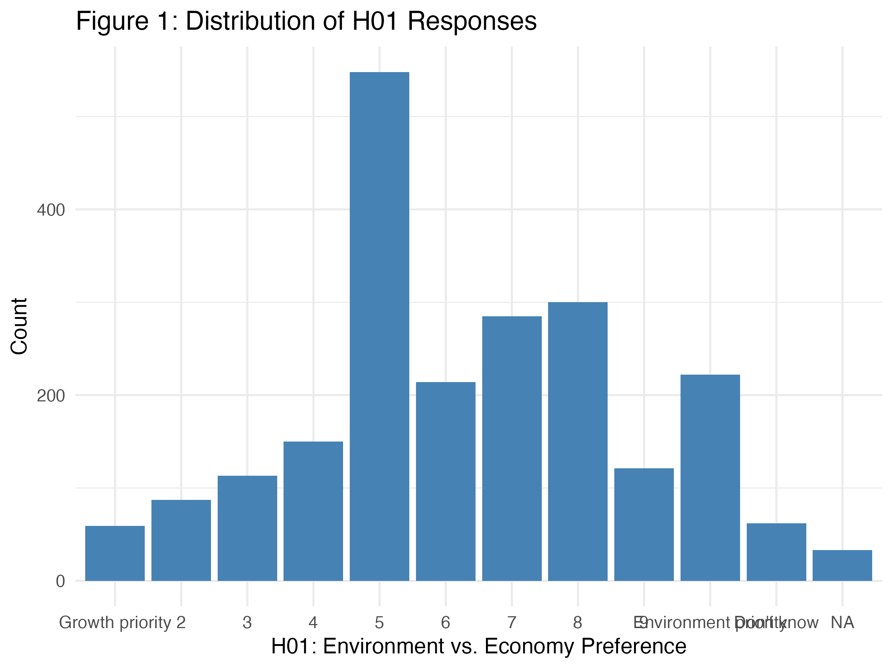
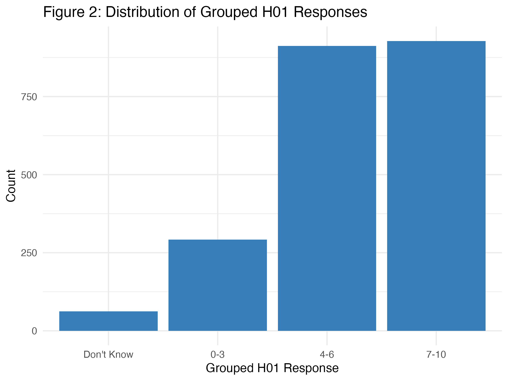

```{r setup, include=FALSE}
knitr::opts_chunk$set(echo = FALSE)

# install.packages("knitr")  # only if not already installed
library(knitr)
library(tidyverse)
library(kableExtra)
```

## Data Justification

* Used 2017 BES for completeness; 2019 data had high missingness due to Covid. More complete data aids generalization despite age.

* Chose XGBoost (non-linear, handles categoricals, boosts generalization via tree ensembles).

* Added "Missing" category where informative; otherwise imputed with random forest.

## Model Justification

* Most responses clustered in the center (Figure 1)
  * To improve model performance, responses were grouped into: growth (0–3), neutral (4–6), and environment (7–10) (Figure 2).
* "Don't Know" responses were poorly predicted and excluded from the final model.

<div style="display: flex; justify-content: space-around;">
  
  
</div>

## Results

* Best model used SMOTE to balance class distribution.
* Outperformed No Information Rate, but confused neutral vs. environment; under-predicted growth—suggesting H1 can't be reliably inferred.

```{r cont_matrix}
conf_mat_test <- readRDS("conf_mat_test_smote_nodk2.rds")

# Extract F1 scores and compute macro average
f1_scores <- round(conf_mat_test$byClass[, "F1"], 3)
macro_f1 <- round(mean(f1_scores, na.rm = TRUE), 3)

# Create summary table
f1_table_test <- data.frame(
  Class = c("Growth priority", "No strong preference", "Environment priority", "Macro Avg"),
  `F1 Score` = c(f1_scores, macro_f1)
)

# Display a smaller table
f1_table_test %>%
  kable(caption = "Table 1: F1 Scores by Class and Macro Average (SMOTE model, Test Set, excl. 'Don't Know') on Unseen Test Data") %>%
  kable_styling(font_size = 12) %>%  # reduce font size 
  footnote(
    general = "F1 Score is the mean of precision and recall. Macro Avg treats all classes equally.",
    general_title = "Note:"
  )
```


## Important variables

* While overall prediction performance was limited, we can still examine which variables influenced model decisions.
* The model relied on Green Party support, income equality views, and age had the greatest influence—but not enough to infer H1 reliably.

<div style="text-align: center;">
  
</div>

